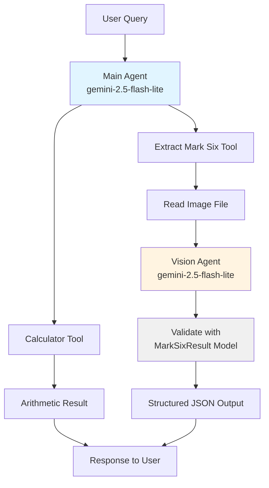

# Venturenix Next-Gen AI Development Class Cohort #5
## Lesson 09
## Installation

This project uses [uv](https://docs.astral.sh/uv/) for Python package management.

1. Install project dependencies:
```bash
uv sync
```

2. Set up environment variables by copying `env.sample` to `.env` and filling in your credentials:
```bash
cp env.sample .env
```

## Scripts

### main.py
A Pydantic AI agent demonstration featuring two specialized tools:
- **Calculator Tool**: Performs basic arithmetic operations (add, subtract, multiply, divide)
- **Mark Six Result Extractor**: Uses vision AI to analyze images of Hong Kong Mark 6 lottery results and extract structured data

The script demonstrates agent delegation by using a dedicated vision agent for image analysis. It includes two demo scenarios showcasing each tool.

**Agent Architecture:**


**Run it:**
```bash
uv run main.py
```

### agentbot.py
An AI-powered Telegram bot that integrates the Pydantic AI agent with calculator and Mark Six vision capabilities.

**Features:**
- **Calculator**: Ask math questions like "What is 125 * 48?" or "Calculate 1000 divided by 25". Supports `/`, `*`, `+`, `-` symbols
- **Mark Six Extractor**: Send an image of Mark Six lottery results, and the bot will extract the structured data using vision AI. Images are automatically optimized for faster processing

**Run it:**
```bash
uv run agentbot.py
```

**Requirements:** Set `TELEGRAM_BOT_TOKEN` in your `.env` file.

**Usage:**
1. Start a chat with your bot in Telegram
2. Send `/start` to see capabilities
3. Send text for calculations: "What is 50 + 30?"
4. Send a photo of Mark Six results for extraction

### echobot.py
A simple Telegram bot that echoes back any text message it receives. Supports `/start` and `/help` commands.

**Run it:**
```bash
uv run echobot.py
```

**Requirements:** Set `TELEGRAM_BOT_TOKEN` in your `.env` file.

### agent_setup.py
Shared agent configuration module containing the Pydantic AI agent setup with calculator and Mark Six vision tools. Imported by both `main.py` and `agentbot.py`.

### models.py
Contains Pydantic models for data validation:
- `MarkSixResult`: Validates Hong Kong Mark 6 lottery results with field validation for draw numbers, dates, main numbers (6 unique numbers between 1-49), and bonus number (must not be in main numbers).
