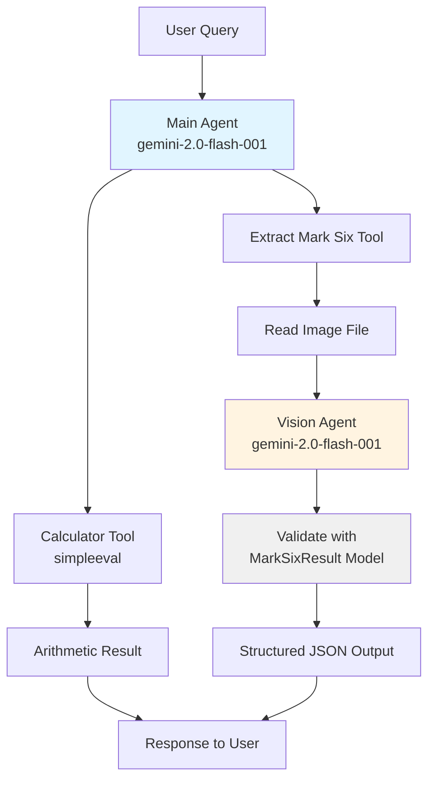

# Venturenix Next-Gen AI Development Class Cohort #5
## Lesson 09
## Installation

This project uses [uv](https://docs.astral.sh/uv/) for Python package management.

1. Install project dependencies:
```bash
uv sync
```

2. Set up environment variables by copying `env.sample` to `.env` and filling in your credentials:
```bash
cp env.sample .env
```

## Scripts

### main.py
A Pydantic AI agent demonstration featuring two specialized tools:
- **Calculator Tool**: Performs advanced arithmetic operations including complex expressions with multiple operators, parentheses, and order of operations (powered by `simpleeval`)
- **Mark Six Result Extractor**: Uses vision AI to analyze images of Hong Kong Mark 6 lottery results and extract structured data

The script demonstrates agent delegation by using a dedicated vision agent for image analysis. It includes two demo scenarios showcasing each tool.

**Agent Architecture:**


**Run it:**
```bash
uv run main.py
```

### agentbot.py
An AI-powered Telegram bot that integrates the Pydantic AI agent with calculator and Mark Six vision capabilities.

**Features:**
- **Advanced Calculator**: Handles simple and complex arithmetic expressions
  - Simple: "1-9", "125 * 48", "1000 / 25"
  - Complex: "1+2/3", "2/4+3*5-1/27", "(2+3)*(4-1)"
  - Supports: order of operations (PEMDAS), parentheses, power (**), decimals
  - Powered by `simpleeval` for safe expression evaluation
- **Mark Six Extractor**: Send an image of Mark Six lottery results, and the bot will extract the structured data using vision AI. Images are automatically optimized for faster processing
- **Mark Six History Query**: Ask about historical lottery data like "What's the latest result?", "How often has number 7 appeared?", or "Show me statistics"

**Run it:**
```bash
uv run agentbot.py
```

**Requirements:** Set `TELEGRAM_BOT_TOKEN` in your `.env` file.

**Usage:**
1. Start a chat with your bot in Telegram
2. Send `/start` to see capabilities
3. Send text for calculations:
   - Simple: "What is 50 + 30?" or "1-9"
   - Complex: "1+2/3" or "2/4+3*5-1/27"
4. Send a photo of Mark Six results for extraction
5. Ask about historical data: "What's the latest result?" or "How often has number 7 appeared?"

### echobot.py
A simple Telegram bot that echoes back any text message it receives. Supports `/start` and `/help` commands.

**Run it:**
```bash
uv run echobot.py
```

**Requirements:** Set `TELEGRAM_BOT_TOKEN` in your `.env` file.

### agent_setup.py
Shared agent configuration module containing the Pydantic AI agent setup with three specialized tools:
- **Advanced Calculator**: 
  - Supports complex expressions: "1+2/3", "2/4+3*5-1/27", "(2+3)*(4-1)"
  - Handles order of operations, parentheses, power (**), decimals, negative numbers
  - Uses `simpleeval` for safe expression evaluation (no arbitrary code execution)
  - Can be called with expression string or separate parameters
- **Mark Six Vision Extractor**: Extract lottery results from images using vision AI
- **Mark Six History Query**: Query historical lottery data from CSV database

**Models:**
- Main Agent: Google Gemini 2.0 Flash ($0.10/$0.40 per 1M tokens)
- Vision Agent: Google Gemini 2.0 Flash (same model for consistency)

Imported by both `main.py` and `agentbot.py`.

### models.py
Contains Pydantic models for data validation:
- `MarkSixResult`: Validates Hong Kong Mark 6 lottery results with field validation for draw numbers, dates, main numbers (6 unique numbers between 1-49), and bonus number (must not be in main numbers).

### test_calculator_standalone.py
Comprehensive test suite for the calculator tool with 36 test cases covering:
- Basic operations (addition, subtraction, multiplication, division)
- Expression parsing ("1-9", "5+3", "10*2")
- Complex expressions ("1+2/3", "2/4+3*5-1/27", "(2+3)*(4-1)")
- Decimals, negative numbers, alternate symbols (×, ÷)
- Error handling (division by zero, invalid expressions, missing parameters)

**Run tests:**
```bash
uv run python test_calculator_standalone.py
```

### history.csv
Historical Mark Six lottery data (50+ draws from 2025-09 to 2026-02). Used by the `query_mark_six_history` tool to answer questions about past results, frequency analysis, and statistics.

**Query examples via Telegram bot:**
- "What's the latest result?"
- "How often has number 7 appeared?"
- "Show me the last 5 draws"
- "Show me statistics"
